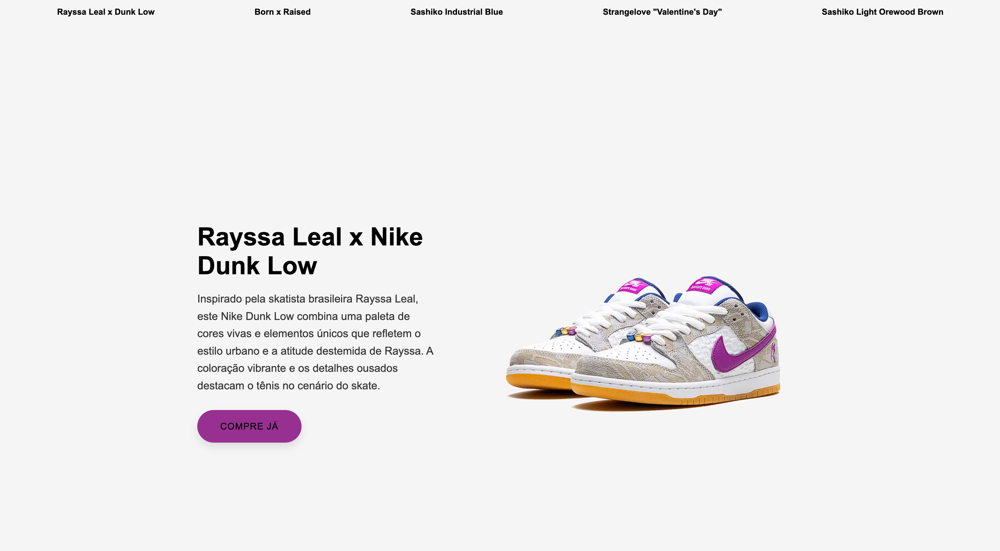

# Landing Page - Nike Dunk Collection

---
## Sobre
Este projeto é uma landing page focada em apresentar cinco modelos de tênis Nike Dunk escolhidos. A página foi desenvolvida em HTML e CSS, com foco em design uma interface limpa e moderna, para mostrar cada modelo com destaque e descrições detalhadas.
O objetivo deste projeto é colocar em prática os conhecimentos adquiridos sobre as linguagens de marcação , HTML, CSS e markdown, durante o curso Técnico em Desenvolvimento de Sistemas do [SENAI Jandira](https://sp.senai.br/unidade/jandira/).

Modelos de tênis apresentados:

- Rayssa Leal x Nike Dunk Low
- Born x Raised x Nike Dunk Low "One Block At Time"
- Nike Dunk Low "Sashiko Industrial Blue"
- Nike Dunk Low x Strangelove "Valentine's Day"
- Nike Dunk Low "Sashiko Light Orewood Brown"
Cada página destaca um modelo específico, com imagem, título e descrição personalizados.

---

## Tecnologias utilizadas
- HTML
- CSS
- Markdown
- Git

---

## Autor

- [Giovanna Xavier](https://www.linkedin.com/in/giovanna-xavier-978538241/)